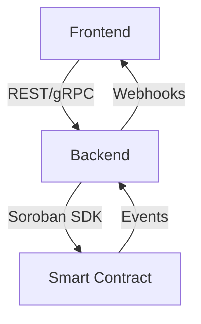

# Architecture Overview

## Backend & Contract Interactions

- **Frontend** communicates with the **Backend** via REST/gRPC APIs.
- **Backend** interacts with **Soroban Smart Contracts** for payment logic.
- **Smart Contracts** emit events consumed by the Backend.
- **Backend** notifies the Frontend via webhooks or polling.

## Key Components
- **Frontend:** Next.js app for user interaction
- **Backend:** NestJS API server
- **Contracts:** Soroban smart contracts (Rust)

---

For more details, see [docs/](./).
